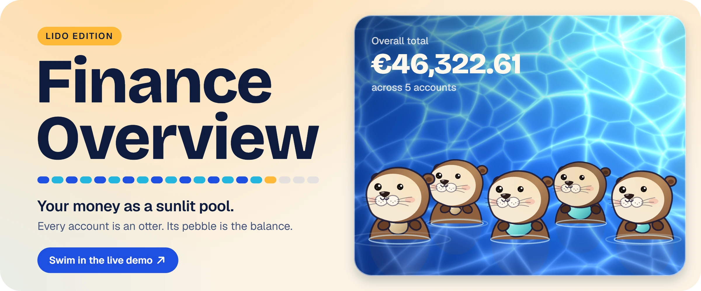
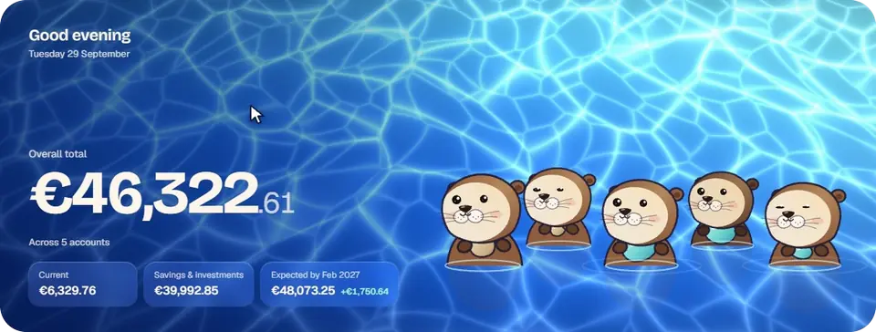
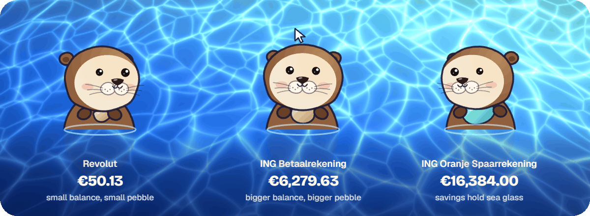
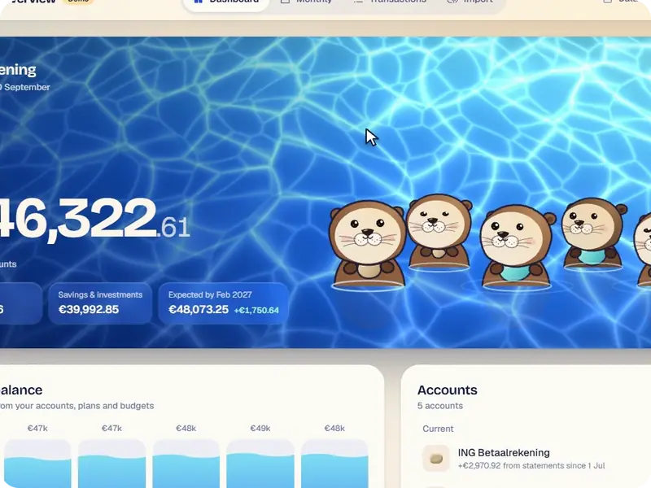
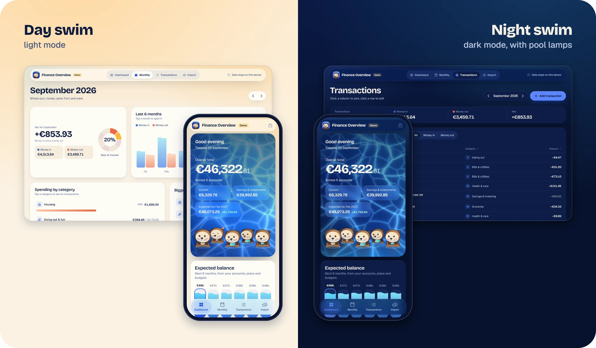
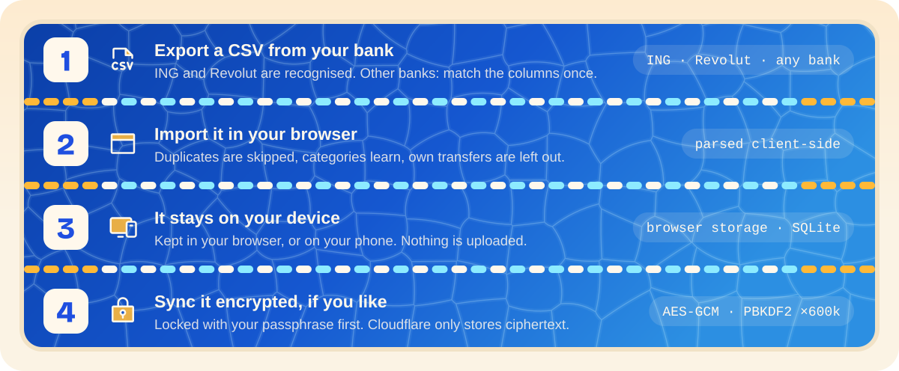

<a href="https://finance-overview-lido.pages.dev">
  <picture>
    <source media="(prefers-color-scheme: dark)" srcset="./assets/readme/hero-night.webp">
    
  </picture>
</a>

<p align="center">
  <a href="https://finance-overview-lido.pages.dev"><b>Open the live demo</b></a>
  &nbsp;·&nbsp;
  <a href="docs/GUIDE.md">Read the guide</a>
  &nbsp;·&nbsp;
  <a href="#run-it">Run it yourself</a>
</p>

<p align="center">
  <picture>
    <source media="(prefers-color-scheme: dark)" srcset="./assets/readme/pool-night.webp">
    
  </picture>
</p>

A private money tracker for your bank statements, redesigned as a swimming pool at golden hour. Import a CSV from your bank, see where the month went and plan the months ahead. Nothing leaves your device unless you turn on end-to-end encrypted sync.

This is a redesign of [kheanzlinares/Finance_Overview](https://github.com/kheanzlinares/Finance_Overview): a new web interface on the same app. The demo is a made-up year for someone in Amsterdam earning €85,000, and anything you change there stays in your browser.

## How to read the pool

<p align="center">
  
</p>

- **Every account is an otter.** Hover one to see the account and its balance, click it to edit.
- **The pebble is the balance.** The richest account holds the biggest stone.
- **Sea glass means savings.** Current accounts hold sand-coloured pebbles.
- **They're alive.** They watch your cursor, blink, yawn, sniff and now and then dive. They smile while the next six months stay above zero and every budget holds, a little less when a budget runs over, and hardly at all when the forecast dips below zero.

The rest of the app speaks the same language: charts fill like water, a budget is a lane rope whose floats turn sun-yellow near the limit and coral when you go over, and the share of your income you kept is a lifebuoy.

## Click anything, it opens poolside

<p align="center">
  <picture>
    <source media="(prefers-color-scheme: dark)" srcset="./assets/readme/card-night.webp">
    
  </picture>
</p>

Editing happens in a card that grows from where you clicked, with a live preview of your change beside the form: the otter's pebble while you type a balance, a plan's next dates as buoys on the water, a budget's lane rope filling up, a debt as a pebble hopping from one otter to another. Deleting takes a one-second hold, so it never happens by accident. On a phone the card is a sheet that slides up from the bottom.

## Day swim, night swim

<p align="center">
  
</p>

Light and dark follow your system, and at night the pool is lit from below. With reduced motion turned on, the water holds still and the otters stop fidgeting.

## How it works

<p align="center">
  <picture>
    <source media="(prefers-color-scheme: dark)" srcset="./assets/readme/workflow-night.svg">
    
  </picture>
</p>

Sync is optional, for using the app on more than one device: you host your own copy on Cloudflare behind a GitHub login, and each device encrypts your data with your passphrase before uploading it (AES-GCM, with a key from PBKDF2 at 600,000 rounds). The [guide](docs/GUIDE.md) covers every feature, how the six-month forecast is worked out, exporting from your bank and hosting with sync.

## Run it

You need [Node.js](https://nodejs.org) 22 and pnpm.

```bash
pnpm install
pnpm web        # then open http://localhost:8081
```

- `pnpm test` runs the tests: CSV parsing, imports, the forecast, storage, encryption and sync.
- Open `/seed.html` on your local copy to load the demo year into that browser, in place of what's there.
- `pnpm deploy:pages` builds the demo and uploads it to Cloudflare Pages.
- To host your own copy with sync, follow [Host it on Cloudflare](docs/GUIDE.md#host-it-on-cloudflare-with-sync).
- The phone app runs in Expo Go: run `pnpm start` and scan the QR code. It has the new colours and type; the water and the otters are web only for now.

## What changed from the original

- **The web design, "Golden-hour Lido".** WebGL water with moving caustic light, otters drawn in code, liquid charts, lane-rope budgets, poolside edit cards, a floating top bar with a dock on phones, and in-app dialogs and toasts. Type is Bricolage Grotesque and Geist, icons are Phosphor. See the [design notes](docs/superpowers/specs/2026-09-29-lido-redesign-design.md).
- **A public demo.** A generated year of finances ([mock-data/generate.ts](mock-data/generate.ts)) loads on a visitor's first visit, moved forward so it always ends yesterday. The demo has no sync and no database.
- **The same app underneath.** Imports, categories, the forecast, budgets, storage and sync work as they did, and the tests still pass.

## Credits

The app is by [kheanzlinares](https://github.com/kheanzlinares). The otters are original code, inspired by GordenSun's [little-critters](https://github.com/GordenSun/little-critters). The hand-inked line that "boils" at 12 fps is adapted from [procedural-film](https://github.com/kuhnhomeuk-cell/procedural-film) by Dean Kuhn (MIT). Fonts: Bricolage Grotesque and Geist (SIL Open Font License). Icons: Phosphor (MIT).

The pictures in this README are made from the app itself: its own water shader and otter engine, and recordings of the live demo. The scripts are in [assets/readme/source](assets/readme/source).
